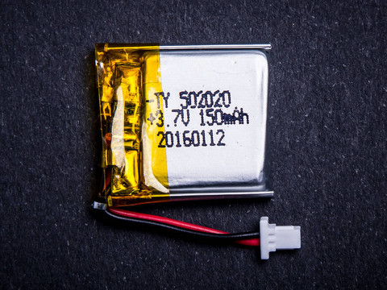

```{r, echo=FALSE}
if (Sys.info()[1]=="Windows"){
#dirData    = "C:\\Users\\sbonhomm\\ownCloud\\Recherche\\Projets\\2016electronicDevelopment\\Essai_marques\\data\\Angly\\"
#dirFigures = "C:\\Users\\sbonhomm\\ownCloud\\Recherche\\Projets\\2016electronicDevelopment\\Essai_marques\\data\\figures\\Angly\\"
dirData    = "C:/Users/sbonhomm/ownCloud/Recherche/Projets/2016electronicDevelopment/Essai_marques/data/Angly/"
dirFigures = "C:/Users/sbonhomm/ownCloud/Recherche/Projets/2016electronicDevelopment/Essai_marques/figures/Angly/"
} else {
dirData="/home/sbonhomm/ownCloudIfremer/Recherche/Projets/2016electronicDevelopment/Essai_marques/data/Angly/"
dirFigures="/home/sbonhomm/ownCloudIfremer/Recherche/Projets/2016electronicDevelopment/Essai_marques/figures/Angly/"
}
```

This is the documentation to build and set up your underwater light data logger using <a href="https://tinycircuits.com/" target="_blank">TinyCircuits</a>.

**DISCLAIMER** 

**We do not have any affiliation with the companies that sell the products we used (they are even not aware we're doing this). As ADAFRUIT mentions on its <a href="https://learn.adafruit.com/neverwet-electronics/overview" target="_blank">website</a>, "*waterproofing electronics is not the intended purpose of NeverWet*". Also, we cannot guarantee that this development will work for any applications and deployment, but we hope that we can get feedback to know whether it worked for you. If it did, let us know and if not, tell us why and what happened ([contact us](mailto:sylvain.bonhommeau@ifremer.fr)).**

# What is the idea?
There is a large number of applications that requires measuring underwater light intensity. This development is directed to a fish tag that will measure light intensity to estimate the geographic position. The basic concept is to estimate the day duration to estimate the latitude and the difference between the GMT noon and the tag noon to estimate the longitude. The data processing to get the geographic coordinates is provided in [Step 5](#section05).

These tags can be pretty expansive and you may want to add other sensors which are not currently available by tag providers. Using <a href="https://tinycircuits.com/" target="_blank">TinyCircuits</a> you can also add other sensors/communication systems etc. to develop you own tag. Please let us know if you improved on this one!

An issue for underwater application is to protect ANGLY from water. We tested a superhydrophobic spray <a href="http://www.neverwet.com/" target="_blank">NeverWet</a> that was coated over ANGLY to assess the feasibility.

Another issue is the pressure that can be pretty high as some species dive at high depth. There is an increase of 1 bar for each 10 m. We carried out some tests at sea and the <a href="https://tinycircuits.com/" target="_blank">TinyCircuits</a> were still working at 479 m (see the [Demo](#sectionDemo))

# What will it do?
**ANGLY** will measure the light intensity (in Lux) every second and save this information on a SD card. The file is open and closed at each iteration so if the system crash, you can still get back the data logged so far. The Tinycircuits clock starts at 00:00 on 1970/01/01 but you might need to have the current time directly logged instead of keeping track of the time when you started the device. You can sync the time of ANGLY with your computer using the <a href="https://processing.org/" target="_blank">Processing</a> sketch described in [Step 3](#section03). Another option is to use an <a href="https://tinycircuits.com/collections/all/products/real-time-clock-tinyshield" target="_blank">Real-time clock shield</a>.

## How deep can you go?
We have carried out some experiments to test the depth until **ANGLY** crashed. Since there is a quartz wraped up into a metallic case on TinyCricuits processing board, the pressure can make it blow for instance. These values are given as an information only and we do not guarantee that **ANGLY** will resist at this depth.
Check out Figure 1 for the depth estimated by a <a href="http://www.nke-instrumentation.com/products/multiparameters-probes/pressure-temperature/sp2t.html" target="_blank">SP2T</a> depth and temperature logger from <a href="http://www.nke-instrumentation.com/" target="_blank">NKE</a> as well as the light intensity that has been measured by ANGLY. When the light intensity stops, it means that ANGLY died. For this experiment, ANGLY went up to 480 m and didn't die. 

## How long can you log data?
Using the 140 mAh battery from <a href="https://tinycircuits.com/collections/accessories/products/lithium-ion-polymer-battery-3-7v-140mah" target="_blank">TinyCircuits</a> with a data saved every second, ANGLY was recording data for 24 h. Using the 270 mAh battery from <a href="https://tinycircuits.com/collections/accessories/products/lithium-ion-polymer-battery-3-7v-270mah" target="_blank">TinyCircuits</a>, ANGLY saved data over 48 h. You can change the frequency of data acquisition and put Angly in sleep mode between data acquisition to save power (see e.g., <a href="http://www.gammon.com.au/forum/?id=11497" target="_blank">Gammon Forum</a>).

## Can I change the data logging frequency?
You can change the Arduino code from [STEP 2](#section02) by replacing `delay(1000);` by the number of ms you want between every data acquisition.

# STEP 1: What you need?
ANGLY is composed of:

Product | Image | Where to buy | Price
------- | ----- | ------------ | -----
140 mAh Litium Ion Polymer battery |  | [Battery](https://tinycircuits.com/collections/all/products/lithium-ion-polymer-battery-3-7v-140mah) | $3.95
Processor Board |  | [CPU](https://tinycircuits.com/collections/processors/products/tinyduino-processor-board) | $19.95
Light sensor |  | [Light sensor](https://tinycircuits.com/collections/sensors/products/ambient-light-tinyshield) | $14.95
SD shield |  | [SD shield](https://tinycircuits.com/collections/memory/products/microsd-tinyshield) | $14.95
SD card |  | [SD card](https://tinycircuits.com/collections/memory/products/microsd-card-and-adapter-8gb) | $9.95
| **Sub-TOTAL** | - | - | **$63.75** |
*The following items can be re-used for other tags* | - | - | -
NeverWet |  | [NerverWet](https://www.amazon.com/Oleum-274232-Never-Multi-Purpose/dp/B00DNQBFAW) | $14.79
USB Shield |  | [USB Shield](https://tinycircuits.com/collections/communication/products/usb-tinyshield) | $14.95
**TOTAL** | - | - | **$93.49**


# STEP 2: Uploading the Arduino sketch {#section02}
Here is the <a href="https://www.arduino.cc/" target="_blank">Arduino</a> code that we used to get light intensity data and save them on an SD card. If you connect your **Angly** with a USB cable to your computer, you can compile and upload this code using the following IDE (by sspecifying "Tinyduino" and the correct port number).

<iframe style="height: 510px; width: 100%; margin: 10px 0 10px;" allowTransparency="true" src="https://codebender.cc/embed/sketch:337324" frameborder="0"></iframe>

Now you can check whether the light lensor and the SD card are working using the following serial monitor:

<iframe style="height: 510px; width: 100%; margin: 10px 0 10px;" allowTransparency="true" src="https://codebender.cc/embed/serialmonitor" frameborder="0"></iframe>

# STEP 3: Sync the time of your ANGLY with you computer {#section03}
You can sync Angly with your computer time using the following *Processing* sketch.

```java
import processing.serial.*;
import java.util.Date;
import java.util.Calendar;
import java.util.GregorianCalendar;
public static final short portIndex = 32;  // select the com port, 0 is the first port
public static final String TIME_HEADER = "T"; //header for arduino serial time message 
public static final char TIME_REQUEST = 7;  // ASCII bell character 
public static final char LF = 10;     // ASCII linefeed
public static final char CR = 13;     // ASCII linefeed
Serial myPort;     // Create object from Serial class
void setup() {  
  size(200, 200);
  println(Serial.list());
  println(" Connecting to -> " + Serial.list()[portIndex]);
  myPort = new Serial(this,Serial.list()[portIndex], 9600);
  println(getTimeNow());
}
void draw()
{
  textSize(20);
  textAlign(CENTER);
  fill(0);
  text("Click to send\nTime Sync", 0, 75, 200, 175);
  if ( myPort.available() > 0) {  // If data is available,
  char val = char(myPort.read());         // read it and store it in val
  if(val == TIME_REQUEST){
    long t = getTimeNow();
    sendTimeMessage(TIME_HEADER, t);   
    }
  else
  { 
    if(val == LF)
    ; //igonore
    else if(val == CR)           
    println();
    else  
    print(val); // echo everying but time request
  }
  }  
}
void mousePressed() {  
  sendTimeMessage( TIME_HEADER, getTimeNow());   
}
void sendTimeMessage(String header, long time) {  
  String timeStr = String.valueOf(time);  
  myPort.write(header);  // send header and time to arduino
  myPort.write(timeStr); 
  myPort.write('\n');  
}
long getTimeNow(){
  // java time is in ms, we want secs    
  Date d = new Date();
  Calendar cal = new GregorianCalendar();
  long current = d.getTime()/1000;
  long timezone = cal.get(cal.ZONE_OFFSET)/1000;
  long daylight = cal.get(cal.DST_OFFSET)/1000;
  return current + timezone + daylight; 
}
```
1. Save this sketch in a folder

2. Check that the `portIndex` value at the 6th line is correct for your computer

3. Run the sketch either from the <a href="https://processing.org/reference/environment/" target="_blank">Processing IDE</a> or using the command line:

```bash
 user@machine:~$ /pathToProcessing/processing /pathToYourPdeFile/time_sync.pde
```

A pop-up window should open and when you click on it, it will sync Angly with your computer.

# STEP 4: Setting everything up

<a href="https://tinycircuits.com/" target="_blank">TinyCircuits</a> are pretty easy to asssemble (even for a marine biologist) and are based on arduino code. For each shield, <a href="https://tinycircuits.com/" target="_blank">TinyCircuits</a> provides the user with a code to run it. The [previous codes](#section02) are based on the <a href="https://codebender.cc/utilities/download/34129?board=TinyDuino&referrer=TinyCircuits" target="_blank">light sensor code</a> and <a href="https://github.com/PaulStoffregen/Time/blob/master/examples/Processing/SyncArduinoClock/SyncArduinoClock.pde">PaulStoffregen Github codes</a> which have been tweaked a bit so it works together. So far, we haven't include any improvements for energy use (sleeps mode) but it can be developped using <a href="http://www.gammon.com.au/forum/?id=11497" target="_blank">Gammon Forum</a> for instance. All the possible improvements are described in [Step 6](#section06) but suggestions and achievements are more than welcome [contact us](mailto:sylvain.bonhommeau@ifremer.fr).

To waterproof ANGLY, we used a superhydrophobic spray from <a href="http://www.neverwet.com/" target="_blank">NeverWet</a>

**Videos of Neverwet coating**


<iframe width="420" height="315" src="https://www.youtube.com/embed/Yg_2SW8MJ3Q" frameborder="0" allowfullscreen></iframe>


# STEP 5: Determine the position of the ANGLY tag {#section05}
There are various ways to geolocate a device using light intensity. The geolocation is however pretty uncertain. Basically, you can expect an uncertainty of 1° in latitude (~110 km) and it is very bad during equinox. Indeed, the geolocation is based on the length of day to estimate the latitude (e.g., if the day lasts 20 hours, you are probably in high latitudes) and the device midday for the longitude (e.g., if it is 3am where you are, you may be in California). Roughly, the geolocation method first estimates the sunset and sunrise time using a regime detection in the time series of light intensities. The algorithm is very sensitive to the accurate detection of the sunset and sunrise so it is better to have a light sensor which is very sensitive to light. It then uses a sun angle elevation value to estimate the twilight values where the sun is actually setting and rising. There are various sources that describes the concept and algorithms which can be found for instance on the <a href="https://en.wikipedia.org/wiki/Light_level_geolocator">Wikipedia</a>, <a href="ftp://ftp.soest.hawaii.edu/tag-data/pdf/Hill.pdf" target="_blank">Hill & Brown paper (2001)</a>,...

Here is a simple <a href="https://cran.r-project.org/">R</a> script which uses the package <a href="https://cran.r-project.org/web/packages/GeoLight/index.html" >GeoLight</a> to geolocate your device using light intensity.
```{r, echo=TRUE, eval=FALSE}
library(GeoLight)
## READ YOUR DATA
tt       <- read.table("/path/to/Angly/logFile/LOGGER02.CSV", header=F)
lux      <- as.numeric(as.character(tt$V1[seq(2,length(tt$V1), by=2)]))
lux      <- lux[-c(1,2)]
time     <- as.POSIXct(as.character(tt$V1[seq(1,length(tt$V1)-1, by=2)]),format="%Y/%m/%d-%H:%M:%S", tz="Indian/Reunion")
time     <- time[-c(1,2)]
analysis <- data.frame(time=time, lux=lux)
# plot the result raw and log-transformed data
par(mfcol=c(1,2))
plot(lux~time, type="l", ylab="Light intensity (lux)", xlab="Time")
plot(log(lux+1)~time, type="l",ylab="Log Light intensity (-)", xlab="Time")
# Produce a mean value of light intensity for each minute from the data collected each second
analysis$mean <- NA
for (i in seq(61,length(analysis$mean), by=59)){
  analysis$mean[i] <- mean(analysis$lux[i-60:i])
}
analysis2      <- analysis[is.na(analysis$mean)==F,]
analysis2$time <- as.POSIXct(as.character(analysis2$time) , tz="Indian/Reunion", format="%Y-%m-%d %H:%M")
### Geolocation from raw data
toto         <- twilightCalc(analysis2$time, analysis2$lux, LightThreshold = TRUE, preSelection = TRUE,
                     maxLight = NULL, ask = TRUE, nsee = 500, allTwilights = FALSE)
toto$tFirst  <- as.POSIXct(strptime(toto$tFirst, tz="Indian/Reunion", format = "%Y-%m-%d %H:%M"))
toto$tSecond <- as.POSIXct(strptime(toto$tSecond, tz="Indian/Reunion", format = "%Y-%m-%d %H:%M"))

estimates    <- coord(toto$tFirst, toto$tSecond,
                   type=toto$type,
                   degElevation = -6) # we use 6° as it corresponds to civil twilight
errorLon <- mean((estimates[1:6,1]- 55.2903)^2)^0.5 # calculate the mean error in Longitude for a known position in La Réunion island
errorLat <- mean((estimates[1:6,2]+ 21.1737)^2)^0.5 # calculate the mean error in Latitude for a known position in La Réunion island

### Same with log-transformed data
toto         <- twilightCalc(analysis2$time, log(analysis2$lux+1), LightThreshold = TRUE, preSelection = TRUE,
                             maxLight = NULL, ask = TRUE, nsee = 500, allTwilights = FALSE)
toto$tFirst  <- as.POSIXct(strptime(toto$tFirst, tz="Indian/Reunion", format = "%Y-%m-%d %H:%M"))
toto$tSecond <- as.POSIXct(strptime(toto$tSecond, tz="Indian/Reunion", format = "%Y-%m-%d %H:%M"))
estimates    <- coord(toto$tFirst, toto$tSecond,
                   type=toto$type,
                   degElevation = -6)
errorLon <- mean((estimates[,1]- 55.2903)^2)^0.5 # calculate the mean error in Longitude for a known position in La Réunion island
errorLat <- mean((estimates[,2]+ 21.1737)^2)^0.5 # calculate the mean error in Latitude for a known position in La Réunion island
```
# Demo: What we've done with it so far? {#sectionDemo}

## Materials and methods
On June 27 2016, we used a boat which was kindly lent by the Brigade Nature de l'Océan Indien (<a href="http://www.oncfs.gouv.fr/Outre-mer-region36/Brigades-Nature-ar923" target="_blank">BNOI</a>). We left Saint-Gilles (Réunion island) harbour at 07:30 am and we headed for high depths to be able to deploy the device. A full description of this mission is described <a href="http://tiyproject.free.fr/Angly/mission20160627/" target="_blank">here</a> (sorry the documentation is in French...).

This is a map of our trip:
```{r, echo=FALSE, warning=FALSE, message=FALSE, fig.align="center"}
library(pacman)
p_load(leaflet, rgdal, htmlwidgets, webshot)
trajet <- readOGR(paste(dirData, "Trace_24-JUIN-16_154605.gpx", sep=""), layer = "tracks", verbose=FALSE)
points <- readOGR(paste(dirData, "Waypoints_24-JUIN-16.gpx", sep=""), layer="waypoints", verbose=FALSE)
positions <- coordinates(points)
popup <- c("Putting Angly in the water", "Getting back Angly")
m <- leaflet() %>%
  addTiles() %>%  # Add default OpenStreetMap map tiles
  setView(lng = 55.20, lat = -21.09, zoom = 12) %>%
  addPolylines(data = trajet, color = "red", weight = 4) %>%
  addMarkers(lng=positions[1,1], lat=positions[1,2], popup=popup[1], options=markerOptions(clickable=TRUE)) %>%
  addMarkers(lng=positions[2,1], lat=positions[2,2], popup=popup[2], options=markerOptions(clickable=TRUE))
m
```
<figcaption>Figure 1: Track of the boat as well as deployement positions</figcaption>

We used a <a href="http://www.nke-instrumentation.com/products/multiparameters-probes/pressure-temperature/sp2t.html" target="_blank">SP2T</a> depth and temperature recorder to be able to determine when (if) the device stopped to work.
Here are some pictures of the line and we used an electric reel to dive the devices. We unwinded 650 m of line.

\textcolor{white}{IMAGE} | \textcolor{white}{IMAGE}
------------------------ | ------------------------
 |  
a) | b)
 | 
c) | d)
<figcaption>Figure 2: Pictures of the mission: a) Equipped line with the tag Angly and the SP2T logger, b) Use of the electric reel to deploy the devices, c) Manoeuvre to maintain the boat close to the line, d) Getting back the devices</figcaption>

When we got *Angly* back on board, it was not blinking anymore and the battery pack was inflated. 

Here is when we got it back:

<iframe width="560" height="315" src="https://www.youtube.com/embed/zE3VltukGwY" frameborder="0" allowfullscreen></iframe>

At the office, we dwnload the data from the <a href="http://www.nke-instrumentation.com/products/multiparameters-probes/pressure-temperature/sp2t.html" target="_blank">SP2T</a> recorder. We tried to read the data on the *Angly* SD card but the pins were correded on the GND pin and the MISO pin. Even after soldering back these pins, the <a href="http://www.lirmm.fr/" target="_blank">LIRMM</a> experts were not able to read the SD card. We changed the battery of *Angly* and it was blinking again! 

<iframe width="560" height="315" src="https://www.youtube.com/embed/Xwk_Uz9X0Kw" frameborder="0" allowfullscreen></iframe>

## Results

### On the electronics
Here are some "close up"" of the different components of *Angly* after the mission


<figcaption>Figure 3: Detailed pictures of Angly processor after the mission</figcaption>


<figcaption>Figure 4: Detailed pictures of Angly SD card shield after the mission</figcaption>


<figcaption>Figure 5: Detailed pictures of Angly light sensor shield card after the mission</figcaption>

We can clearly see that some areas have been protected while other have been damaged (corrosion).

### Data from the SP2T depth and temperature recorder
Here are the evolutions of temperature and depth that the devices encountered. It took us roughly one hour to reel down and up the devices and we used 650 m of line to reach *circa* 450 m in depth (due to currents and drift).

```{r, echo=FALSE, warning=FALSE, message=FALSE, fig.align="center"}
library(pacman)
p_load(ggplot2, plyr, reshape, evaluate, htmlwidgets, webshot)
#p_load_gh("ramnathv/rCharts")
library(highcharter)
sonde <- read.table(paste(dirData, "SP2T_Radio_31064_20160627_084807.csv", sep=""), sep=";", header=T)
colnames(sonde) <- c("Date", "Temperature", "Profondeur")
sonde$Date <- as.POSIXct(as.character(sonde$Date), format="%d/%m/%Y %H:%M:%S")
sonde$Profondeur <- -sonde$Profondeur
#sonde2 <- melt(sonde)

hc_opts <- list()
hc_opts$toolbox <- list(
    show = TRUE,
    feature = list(
      restore = list(show = TRUE),
      magicType = list(show = TRUE, type = c('force', 'chord')),
      saveAsImage = list(show = TRUE)
    )
  )
hc_opts$title <- list(text="Temperature and depth measured by the SP2T data logger")
hc <- highchart(hc_opts) %>%
hc_xAxis(categories = format(sonde$Date, format="%H:%M") ) %>%
hc_yAxis(
    list(
      title = list(text = "Profondeur"),
      align = "left",
      showFirstLabel = FALSE,
      showLastLabel = FALSE,
      labels = list(format = "{value} m")
    ),
    list(
      title = list(text = "Temperature"),
      align = "right",
      showFirstLabel = FALSE,
      showLastLabel = FALSE,
      labels = list(format = "{value} &#176;C", useHTML = TRUE),
      opposite = TRUE
    )
  )  %>%
hc_add_serie(name = "Profondeur",  data = sonde$Profondeur, type="spline") %>%
hc_add_serie(name = "Temperature", data = sonde$Temperature, type="spline", yAxis = 1) 
hc
```
<figcaption>Figure 6: Evolution of the temperature et and depth over the deployment of the 650 m of line</figcaption>


# STEP 6: What's next? {#section06}

Our steps are now:

1. Increase the waterproofing of the battery (using epoxy resin)

2. Increase the waterproofing of the SD card (probably by covering it better with the hydrophobic spray)

3. Try a full waterproofing with epoxy resin


Of course, a lot of things can be improved as we are just getting started. Here is a list of priorities:

1. Try it on fish! We are just starting to test an anchor system. 

2. Improve the waterproofing as the hydrophobic coat does not seem to be enough for the battery

3. Improve the autonomy of the battery by switching to sleeping mode and getting a bigger battery

4. Add an <a href="https://tinycircuits.com/collections/sensors/products/9-axis-imu-tinyshield">IMU</a> to investigate fish behaviors.

5. Find a way to transfer the data automatically after the tag detached for the fish (any ideas). Just a reminder: fish and tags are at sea... so for antennas, distance from the coast,... it's not simple...

#Notes
This document is a <a href="http://rmarkdown.rstudio.com/" target="_blank">RMarkdown</a> doc. You can see the code inline this webpage <a href="http://tiyproject.free.fr/Angly/howto/Angly2.html" target="_blank">here</a> or download this file as a <a href="http://tiyproject.free.fr/Angly/howto/Angly.Rmd" target="_blank">*RmD*</a>.

We thank the Brigade Nature de l'Océan Indien for their help and authorizations (Jacques Fayan for driving us there).


